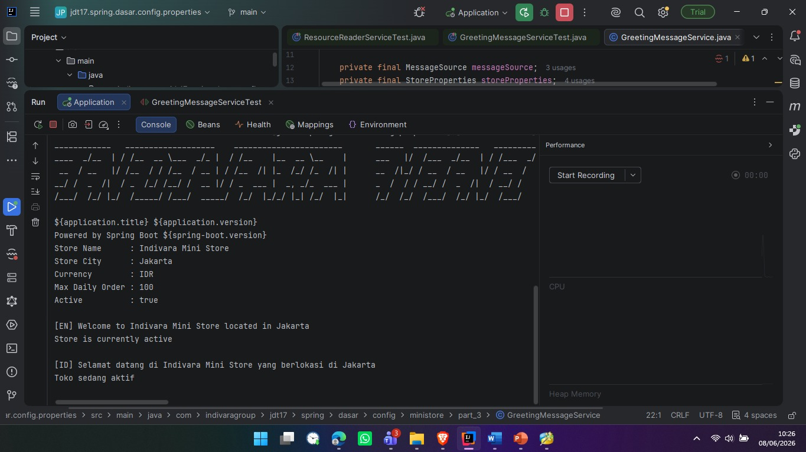
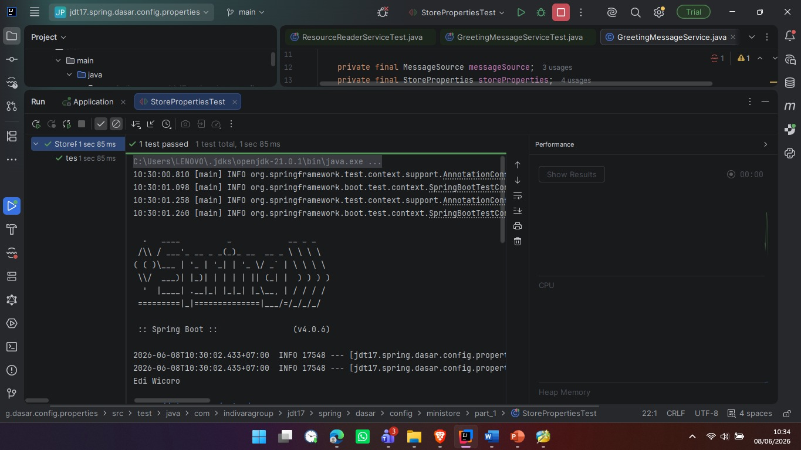
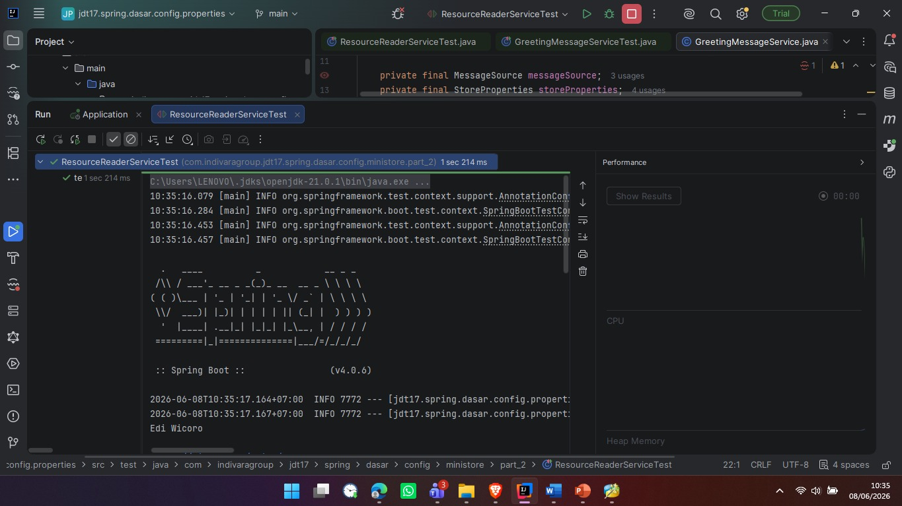
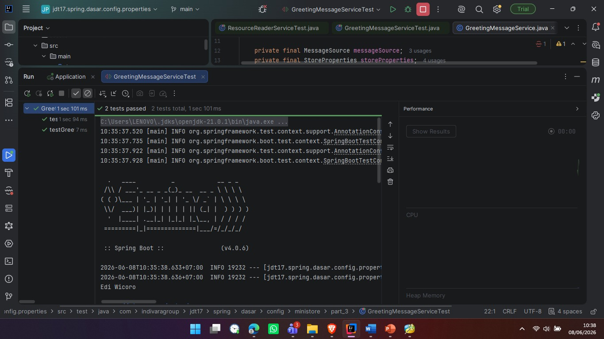

# Mini Store Configuration App

## 1. Source Code Project
Project ini dibagi menjadi beberapa bagian utama:

* **Part 1:** Mapping konfigurasi YAML menggunakan `@ConfigurationProperties`.
* **Part 2:** Pembacaan file teks (`banner-store.txt`) menggunakan `ResourceLoader`.
* **Part 3:** Implementasi multibahasa (English & Indonesia) menggunakan `MessageSource`.
* **Part 4:** Eksekusi aplikasi menggunakan `CommandLineRunner`.
* **Test:** Pengujian terpisah (Unit Test) untuk setiap bagian (*Part 1 - Part 3*) menggunakan `@SpringBootTest`.

---

## ## 2. Screenshot Output Terminal

### Screenshot 1 - Output Ministore

<p align="center">
    
</p>

### Screenshot 2 - Test Store Properties

<p align="center">
    
</p>

### Screenshot 3 - Test Resource Loader

<p align="center">
    
</p>

### Screenshot 4 - Greeting Messages

<p align="center">
    
</p>

---

### Detail Teks Output

```text
==========================
   INDIVARA MINI STORE
==========================

Store Name      : Indivara Mini Store
Store City      : Jakarta
Currency        : IDR
Max Daily Order : 100
Active          : true

[EN] Welcome to Indivara Mini Store located in Jakarta
Store is currently active

[ID] Selamat datang di Indivara Mini Store yang berlokasi di Jakarta
Toko sedang aktif
```


## 3. Penjelasan Konsep yang Digunakan

### Apa fungsi `@ConfigurationProperties`?

Anotasi ini digunakan untuk memetakan (menyambungkan) nilai-nilai yang ada di dalam file konfigurasi seperti `application.yml` atau `application.properties` secara massal ke dalam sebuah kelas Java (POJO).

Dengan fitur ini, kita tidak perlu memanggil data satu per satu menggunakan `@Value`, melainkan semua data yang memiliki awalan (*prefix*) yang sama (contoh: `store`) akan otomatis masuk ke variabel kelas Java secara rapi dan mudah dipelihara.

**Contoh konfigurasi YAML:**

```yaml
store:
  name: Indivara Mini Store
  city: Jakarta
  currency: IDR
  max-daily-order: 100
  active: true
```

---

### Apa fungsi `ResourceLoader`?

`ResourceLoader` adalah interface bawaan Spring yang berfungsi untuk mencari dan memuat berbagai macam file resource eksternal ke dalam aplikasi.

File dapat berada di:

- Classpath (`src/main/resources`)
- Sistem file komputer (`file:`)
- URL atau internet (`http:` atau `https:`)

Pada project ini, `ResourceLoader` digunakan untuk membaca isi file `banner-store.txt` secara fleksibel tanpa harus menuliskan lokasi direktori secara hardcode.

---

### Apa fungsi `MessageSource`?

`MessageSource` adalah interface bawaan Spring yang digunakan untuk mendukung fitur **Internationalization (i18n)** dan **Localization (l10n)**.

Fungsinya adalah mengambil teks atau pesan dari file kamus seperti:

- `messages.properties` (Bahasa Inggris)
- `messages_id.properties` (Bahasa Indonesia)

berdasarkan **kode pesan** dan **Locale** yang digunakan.

Selain menerjemahkan teks, `MessageSource` juga mampu memasukkan data dinamis ke dalam kalimat menggunakan placeholder seperti `{0}`, `{1}`, dan seterusnya.

**Contoh:**

```properties
welcome.message=Welcome to {0} located in {1}
```

akan menghasilkan:

```text
Welcome to Indivara Mini Store located in Jakarta
```

setelah parameter `{0}` dan `{1}` diganti dengan nama toko dan kota.

---

## 4. Kesimpulan

Project ini menunjukkan implementasi beberapa fitur penting pada Spring Boot, yaitu:

- Konfigurasi aplikasi menggunakan `@ConfigurationProperties`
- Pembacaan file resource menggunakan `ResourceLoader`
- Dukungan multibahasa menggunakan `MessageSource`
- Eksekusi otomatis aplikasi menggunakan `CommandLineRunner`
- Pengujian fitur menggunakan `@SpringBootTest`

Dengan pendekatan ini, konfigurasi aplikasi menjadi lebih terstruktur, fleksibel, dan mudah dikembangkan untuk kebutuhan aplikasi yang lebih besar.
